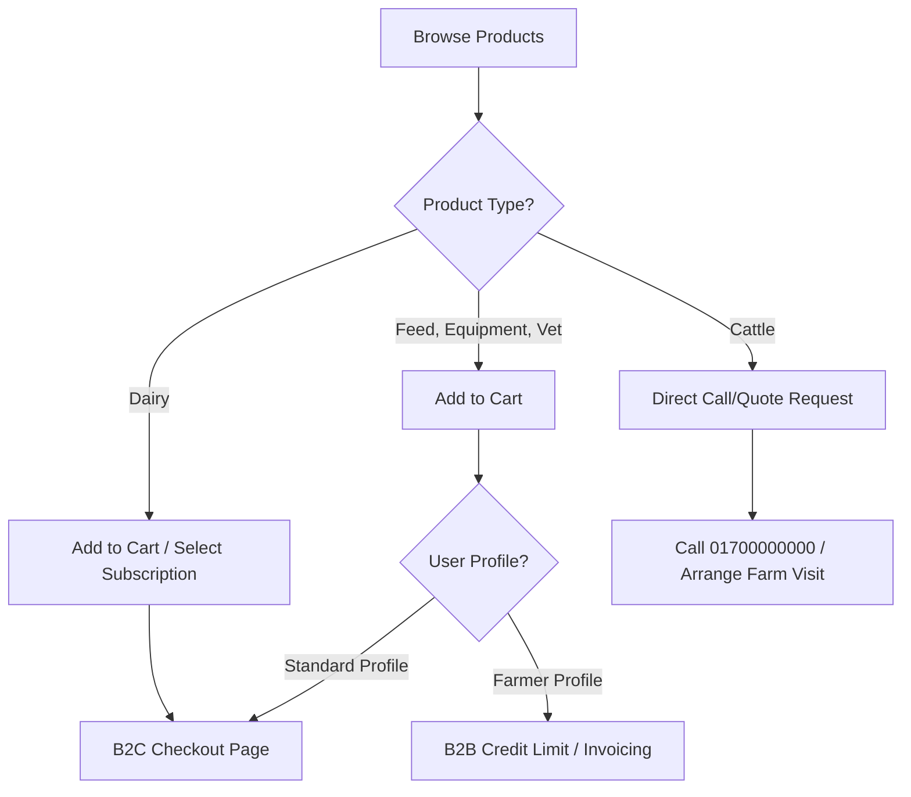

# Product Catalog Specification — Alam Dairy

This document audits the structure, categorization, schemas, and purchase flows of the **Alam Dairy product catalog**.

---

## 1. Product Classification
The database enforces five distinct product categories under the `type` column in `public.products`:

| Category (`type`) | Focus | Target Customer | Standard Unit | Purchase Type |
| :--- | :--- | :--- | :--- | :--- |
| `dairy` | Consumer milk, ghee, yogurt, paneer, and traditional sweets. | B2C Consumers | Litre, 500ml, kg, piece | Direct / Subscription |
| `feed` | Nutritional feed, concentrate mixes, straw, and mineral licks. | B2B / Farmers | 50kg bag, 25kg bag, bale | Direct / Bulk Tiers |
| `cattle` | Live livestock: cows, heifers, breeding bulls, and calves. | B2B / Farmers | Head | Quote / Inspection |
| `equipment` | Milking machinery, storage cans, testing tools, and feeders. | B2B / Farmers | Piece, Set | Direct / Invoice |
| `vet_supply` | Supplements, hygiene chemicals, vaccines, and test kits. | B2B / Farmers | Bottle, Vial, 10-pack | Direct / COD |

---

## 2. Product Database Schema (JSON/PostgreSQL)
The database structure (from `lib/supabase/types.ts`) defines how products, variants, and pricing tiers are stored:

* **Unified Products Table (`products`)**:
  * `slug` (text, unique): Product URL identifier.
  * `name_bn` / `name_en` (text): Localized product titles.
  * `description_bn` / `description_en` (text): Localized copy.
  * `price` / `sale_price` (numeric): Standard retail pricing.
  * `unit` (text): Unit of sale (e.g., 'litre', '50kg bag', 'head').
  * `stock` (integer): Quantity in inventory.
  * `is_active` (boolean): Visibility state.
  * `images` (text[]): Image array.
  * `tags` (text[]): Tag array (e.g., 'halal', 'fresh', 'premium').
  * `meta` (jsonb): Custom metadata (e.g., breed, weight, milk yield).
  * `subscription_eligible` (boolean): Flag to enable recurring order flows.
  * `allow_backorder` (boolean): Backordering support.
* **Product Variants (`product_variants`)**:
  * Extends products with specific SKUs, prices, sale prices, and stock counts based on custom `attributes` (e.g., packaging sizes, breed colors).
* **Bulk Pricing Tiers (`bulk_pricing_tiers`)**:
  * Stores volume discounts (e.g., buying 10+ feed bags reduces price per unit).
* **B2B Price Lists (`b2b_price_lists`)**:
  * Customer-specific or role-specific pricing maps, allowing certified farmers to purchase supplies at discounted prices.

---

## 3. Product Catalog Structure & Representative Items
The catalog is split into standard categories:

### A. Dairy Products (`dairy`)
* **Core Milk**: Fresh Milk (1L, 500ml, 2L), A2 Milk 1L, Buffalo Milk 1L, Skimmed Milk 1L.
* **Cultured Dairy**: Mishti Doi (500g, 1kg), Plain Yogurt (500g), Sour Cream, Kefir, Buttermilk.
* **Fats & Oils**: Pure Desi Ghee (250g, 500g, 1kg), Butter (200g, 500g).
* **Cheeses**: Paneer (250g, 500g), Mozzarella Cheese (250g).
* **Traditional Sweets & Curds**: Chhana, Khoya, Sweet/Salty Lassi, Condensed Milk, Milk Powder.

### B. Farm Feeds (`feed`)
* **Concentrates**: Cattle Feed (50kg), Dairy Cow Concentrate (25kg), Calf Starter Feed (20kg), Soybean Meal (50kg), Cotton Seed Cake (50kg).
* **Roughage & Grains**: Wheat Bran (50kg), Rice Straw Bale, Maize Silage (25kg), Hay Bale, Green Grass Bundle, Sugarcane Bagasse (50kg).
* **Supplements**: Molasses (20L), Urea Block (5kg), Bypass Fat (25kg), Mineral Mixture (10kg), Salt Block (2kg).

### C. Live Cattle (`cattle`)
* **Dairy Breeds**: Holstein Friesian Milking Cow, Jersey Cow, Sahiwal Cow, Murrah Buffalo, Local Breed Cow, Nili-Ravi Buffalo.
* **Heifers & Calves**: Holstein Heifer Calf, Crossbred Heifer, Pregnant Heifer, Male Calf, Young Heifer.
* **Breeding & Beef**: Breeding Bull (high-genetic merit), Beef Bull (for Eid/Qurbani fattening), Crossbred Bull Calf.

### D. Farm Equipment (`equipment`)
* **Milking & Storage**: Milking Machine (Single/Double cluster), Milk Chilling Tank (100L/500L), Milk Can (20L SS / 10L Aluminium), Milking Bucket 20L SS.
* **Quality & Processing**: Lactometer, Fat Tester Gerber Method, Pasteurizer 50L, Cream Separator, Butter Churn 10L, Yogurt Incubator 20L.
* **Livestock Management**: Galvanized Feeding Trough, Water Trough 100L, Ear Tag Set, Cattle Scale 2T, Drenching Gun, Teat Dip Cup, Barn Cleaner Set.

### E. Veterinary Supplies (`vet_supply`)
* **Nutritional**: Mineral Block, Calcium Supplement 1L, Vitamin ADE Injection 100ml, Liver Tonic 1L, ORS Sachets.
* **Vaccines & Antiseptics**: FMD Vaccine 50ml, Brucellosis Vaccine, Teat Dip Antiseptic 5L, Udder Cream 500g.
* **Diagnostic & Treatment**: Oxytetracycline Injection (Antibiotic), Dewormer Bolus, Mastitis Test Kit (CMT), Bovine Pregnancy Test Kit, Insecticide Spray 1L, Wound Spray 200ml.

---

## 4. Operational Purchase Flows
The application handles transactions through three pathways depending on product type:

### B2C Subscription Flow
If `subscription_eligible` is `true` for a dairy product, customers can select a subscription frequency (`daily`, `weekly`, `biweekly`, `monthly`) at checkout, bypassing single-order logic to create a recurring automated billing profile.

### B2B Wholesale & Credit Flow
Registered farmers with `is_farmer` set to `true` can checkout B2B supplies (feed, equipment, vet care) using their allocated `credit_limit`. Orders are processed via internal invoicing against their profile record.

### Cattle Negotiation Flow
Live cattle listing pages feature a prominent **Call for Quote** CTA button linked directly to the farm office (`tel:01700000000`). This is designed to facilitate physical farm visits, health certificate checks, and pricing negotiations before financial transaction.
